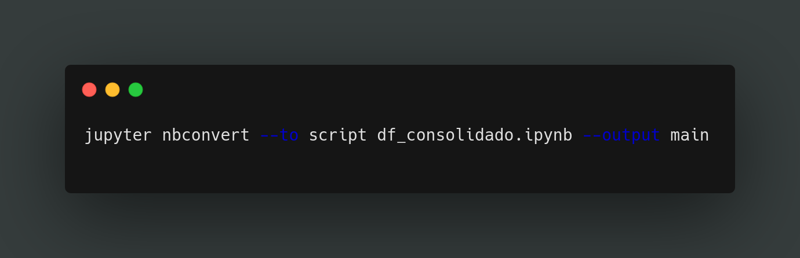
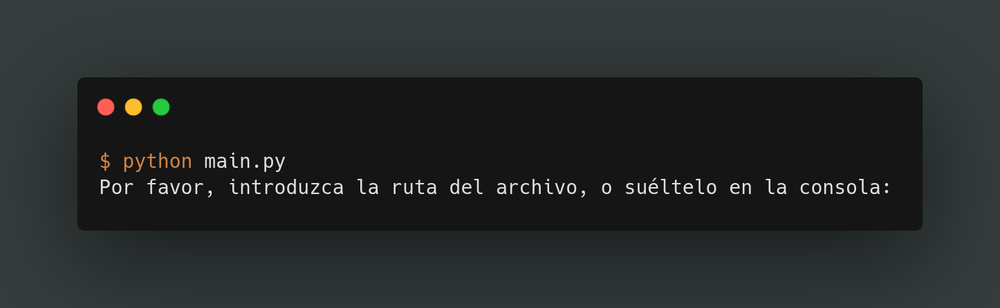

# Proyecto de consolidación de datos

Este proyecto busca automatizar la recepción, estandarización y centralización de reportes de ventas enviados por correo electrónico en distintos formatos (Excel, PDF, CSV, imagen). A través de scripts en Python, los datos serán convertidos a CSV, almacenados en la nube, cargados en una base de datos MariaDB y visualizados mediante dashboards en Power BI. El objetivo es mejorar la eficiencia del análisis comercial reduciendo procesos manuales y errores.


## Estructura del Repositorio (provisionalmente)

- `src/`: Scripts de Python
- `docs/`: Documentación técnica
- `data/`: Archivos de entrada (ejemplos)
- `README.md`: Esta guía
- `requirements.txt`: Dependencias

## Tecnologías

- Python
- MariaDB
- Power BI
- pandas, pdfplumber, etc.

## Autores

-Enderson David Ariza Serna
-Maria Alejandra Caro Martínez
-Miguel Angel Gonzalez


# 🚪 Punto de Entrada del Proyecto
<p>Si tienes nbconvert instalado (viene con Jupyter), puedes ejecutar esto en la terminal:</p>



<p>Esto generará automáticamente un archivo llamado main.py con todas las celdas de código.</p>
<br><br>

## 🖥️ Ejemplo de ejecución (en desarrollo 🤓)
Al ejecutar el archivo `main.py`, se mostrará el siguiente mensaje en la consola:

<br><br>

```markdown
## 🔮 Funcionalidades esperadas (en desarrollo o futuras)

- ✅ Consolidación de archivos Excel o CSV.
- ✅ Limpieza de datos (eliminación de nulos, formatos).
- 📊 Visualización básica de datos.
- 📁 Guardado de archivos procesados.
- 🧠 Análisis automático por tipo de variable.
- 💬 Retroalimentación desde la consola.
- 🔗 Integración
```
<br><br>
## 🌐 Destinos del análisis / Integraciones

Una vez procesados los datos, el sistema genera salidas compatibles con herramientas populares de análisis y visualización:

- 📊 **Power BI**  
  Los archivos `.xlsx` o `.csv` generados son fácilmente importables para la creación de dashboards dinámicos.

- 🧮 **Microsoft Excel**  
  Ideal para continuar el análisis manual o usar tablas dinámicas.

- ☁️ **Google Sheets**  
  Posibilidad de cargar los resultados en la nube para compartir en línea.

- 📈 **Dashboards Web** *(futuro)*  
  Se contempla una posible integración con frameworks como `Streamlit` o `Dash` para visualización en aplicaciones web.


## 🧩 Posible Integración en un Sistema Mayor
Este script ha sido desarrollado con la idea de ser reutilizable como parte de un sistema más amplio de análisis y automatización de datos. Su diseño modular permite que pueda:

- Funcionar como **herramienta independiente**, ejecutable desde la consola (Bash, Zsh, etc.).
- Ser integrado como **una función dentro de una aplicación mayor** (por ejemplo, una interfaz gráfica, una API, o un orquestador de flujos de datos).
- Ser llamado por **scripts automatizados**, **schedulers** o pipelines de datos (como cronjobs, Airflow, etc.).


